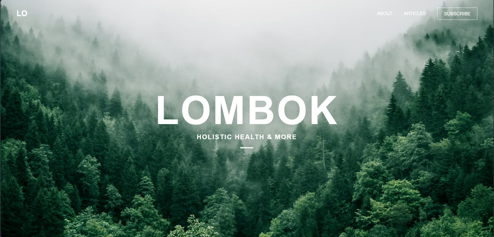
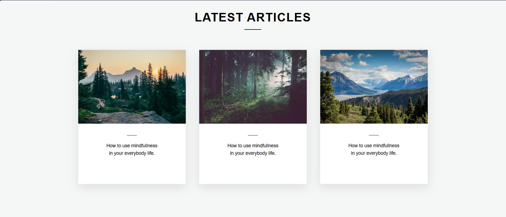
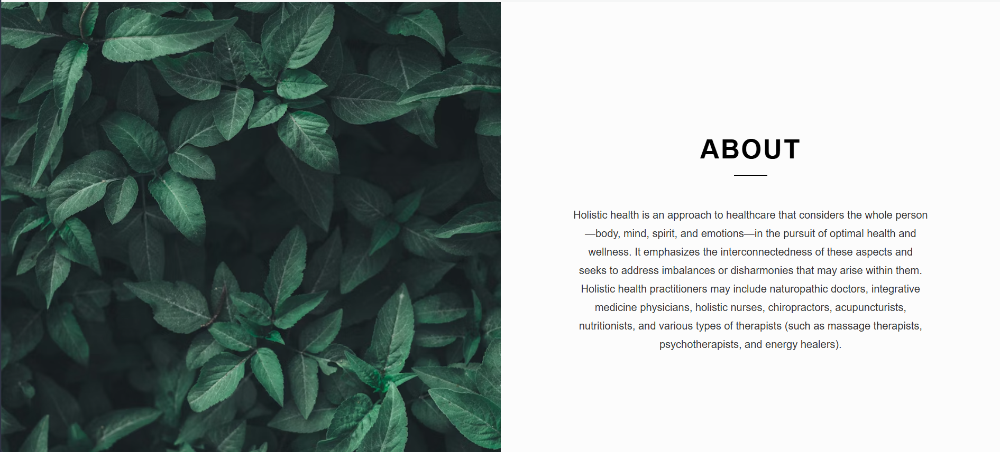
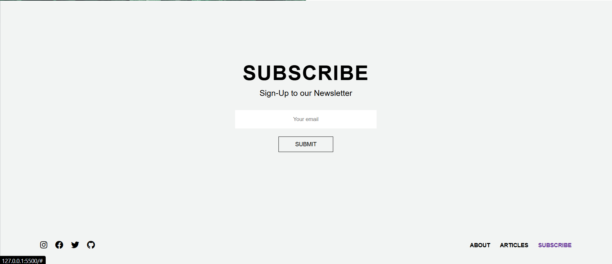

# 🌿 Lombok Website - Assignment 5

This project is part of **Assignment 5**, where I recreated a complete multi-section website using **HTML and CSS**.

The design is inspired by a modern clean UI layout focused on **nature, health, and minimal design aesthetics**.

---

## 🚀 Features

- Full landing page layout (Hero, Articles, About, Subscribe, Footer)
- Clean and modern UI design
- Proper spacing and alignment
- Image-based sections with text overlay
- Smooth hover effects on buttons and cards
- Responsive layout structure

---

## 🛠️ Technologies Used

- HTML5
- CSS3
- Flexbox
- Position (relative & absolute)

---

## 📸 Screenshots

---

## 🎯 What I Learned

- How to build a **full website layout from scratch**
- Better understanding of **section-based design**
- Improved skills in **layout structuring**
- Working with **background images and overlays**
- Using **flexbox for alignment**
- Managing spacing and typography properly

---

## 💡 Note

I completed most of the design by myself.  
I took a little help for understanding some layout approaches and improving structure.

---

## 🏁 Conclusion

This assignment helped me improve my **frontend development skills** and gave me confidence in building real-world UI designs.  

Excited to keep learning and building more! 🚀

---

## Author
- **Name**: Shikhar Mishra